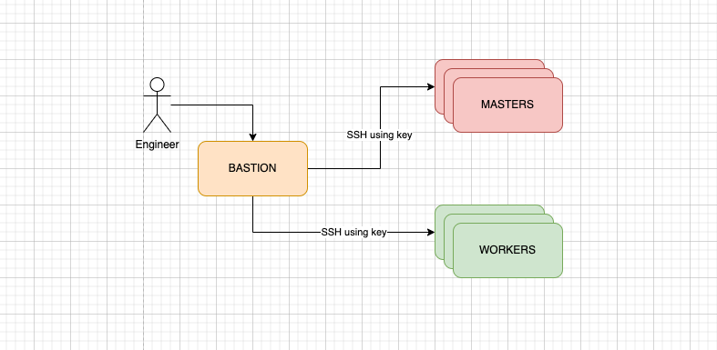
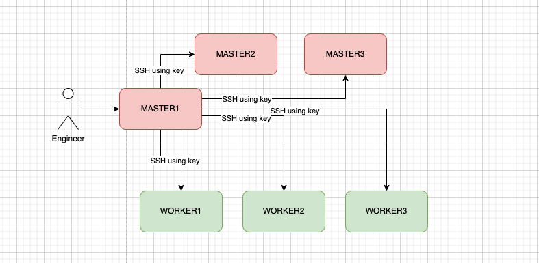

# Instalação do Kubernetes com Kubespray

## Introdução

O Kubespray permite a instalação do Kubernetes de forma automatizada e repetível. Neste guia, abordamos duas formas recomendadas de instalação, que consideramos boas práticas para facilitar a manutenção do cluster.

## Métodos de Instalação

### 1️⃣ Usando um Bastion Host (Recomendado)



Este método utiliza um **Bastion Host** como ponto central de acesso para todos os nós do cluster. Essa abordagem é recomendada porque:
- Facilita a atualização do cluster e a instalação de dependências.
- Melhora a segurança ao evitar acesso direto aos nós.
- Simplifica tarefas de manutenção, como renovação de certificados.
- Permite adicionar ou remover hosts do cluster de maneira eficiente.

### 2️⃣ Usando um dos Hosts Master



Outra abordagem possível é utilizar um dos **nós MASTER** para realizar a instalação e manutenção do cluster. Nesse caso:
- O nó MASTER1 assume o papel de controlador da instalação.
- O SSH é utilizado para comunicação com os demais nós.
- Pode ser uma alternativa viável em ambientes menores, mas requer mais cuidado para evitar sobrecarga no nó mestre.

## Recomendação de Instalação

Recomendamos fortemente a **utilização do Bastion Host** para maior segurança e praticidade na administração do cluster. Esse modelo permite uma melhor organização e facilita futuras manutenções e expansões do Kubernetes.

Se precisar de mais detalhes, siga os próximos passos deste repositório para a configuração do ambiente.

---

## 📂 Diretório `install_steps`

O diretório `install_steps` contém um guia detalhado sobre como preparar o sistema operacional **Oracle Linux 9** para a instalação do Kubernetes com o Kubespray.

### 📌 O que está incluído:
- **Passo a passo para instalação dos pacotes necessários**
- **Configuração do sistema operacional para suporte ao Kubernetes**
- **Instruções para clonar o repositório Kubespray**

### 📥 Clonando o repositório do Kubespray
Para iniciar a instalação do Kubernetes com o Kubespray, primeiro clone o repositório oficial:

```sh
 git clone https://github.com/kubespray/kubespray.git
```

Em seguida, siga os passos do diretório `install_steps` para preparar o sistema antes da execução do Kubespray.

